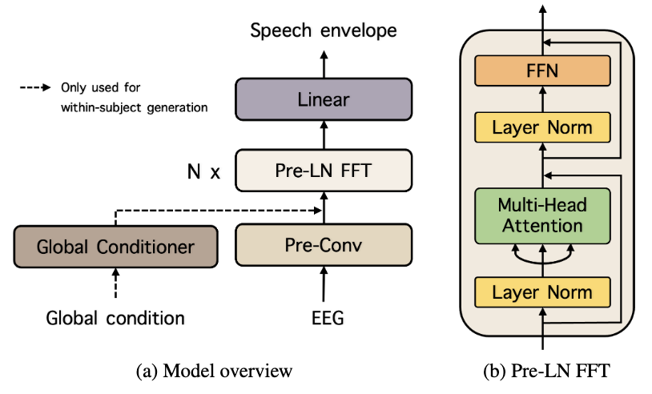

<!-- # Autovocoder: Fast Waveform Generation from a Learned Speech Representation using Differentiable Digital Signal Processing -->
# HappyQuokka: SYSTEM FOR ICASSP 2023 AUDITORY EEG CHALLENGE 
<!-- Official Pytorch implementation of [Challenge Paper Title](link). -->
Official Pytorch implementation of HappyQuokka system that submitted to the 2023 ICASSP Auditory EEG challenge task 2: regression.
This repository is based on **[FastSpeech github](https://github.com/xcmyz/FastSpeech) [(Paper)](https://arxiv.org/abs/1905.09263)**.<br>

<p align="center"></p>


## Training :
```
python train.py --experiment_foler "Your experiment name."
```
In `train.py`, change `--dataset_folder` to the absolute path of the dataset directory.<br>

## Note:
* Auxiliary global conditioner only used for within-subjects generation.
* When generating stimulus for heldout-subjects, please change `--g_con` in `train.py` into False.


## Citations :
```
% FastSpeech
@article{fastspeech,
  title={Fastspeech: Fast, robust and controllable text to speech},
  author={Ren, Yi and Ruan, Yangjun and Tan, Xu and Qin, Tao and Zhao, Sheng and Zhao, Zhou and Liu, Tie-Yan},
  journal={Advances in neural information processing systems},
  volume={32},
  year={2019}
}
% Prenorm
@inproceedings{prelayernorm,
  title={On layer normalization in the transformer architecture},
  author={Xiong, Ruibin and Yang, Yunchang and He, Di and Zheng, Kai and Zheng, Shuxin and Xing, Chen and Zhang, Huishuai and Lan, Yanyan and Wang, Liwei and Liu, Tieyan},
  booktitle={International Conference on Machine Learning},
  pages={10524--10533},
  year={2020},
  organization={PMLR}
}

%EEG dataset
@data{eegdata_K3VSND_2023,
author = {Bollens, Lies and Accou, Bernd and Van hamme, Hugo and Francart, Tom},
publisher = {KU Leuven RDR},
title = {{A Large Auditory EEG decoding dataset}},
year = {2023},
version = {V1},
doi = {10.48804/K3VSND},
url = {https://doi.org/10.48804/K3VSND}
}
```

## References:
* https://github.com/xcmyz/FastSpeech
